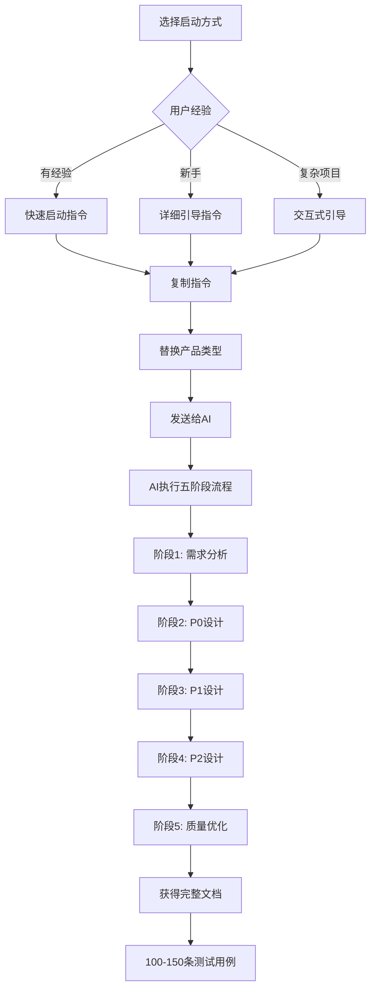

# testcase-generate-ai

[English](README_EN.md) | 中文


## 📋 项目简介

这是一个标准化的测试用例设计工具包，基于Trade模块的成功经验，可以为任何产品类型快速生成高质量的测试用例。

### 🤖 技术支持
- **AI模型**: Claude Sonnet 4 (Anthropic)
- **开发平台**: Augment Agent (Augment Code)
- **核心能力**: 世界领先的代码库上下文引擎 + 智能测试用例设计

### 📊 项目统计
- ✅ **130条** Trade模块成功案例
- 🎯 **8种** 产品类型专用模板
- 📚 **3种** 启动方式选择
- 📋 **1个** 真实项目案例
- 🛠️ **完整** 质量保证体系

## 📁 目录结构

```
testcase-generate-ai/
├── README.md                           # 本文档
├── README_EN.md                        # 英文版文档
├── 📁 1-启动指令库/                     # 快速启动指令集
│   ├── 快速启动指令.md                  # 有经验用户使用
│   ├── 详细引导指令.md                  # 新手用户使用
│   └── 交互式引导指令.md                # 复杂项目使用
├── 📁 2-标准工作指南/                   # 核心工作流程文档
│   ├── 完整工作指南.md                  # 主要工作指南（推荐）
│   ├── 质量控制标准.md                  # 质量标准和检查清单
│   └── 成功经验总结.md                  # Trading模块经验提取
├── 📁 3-产品类型模板/                   # 不同产品类型的专用模板
│   ├── 交易系统模板.md                  # 基于Trading模块
│   ├── 支付系统模板.md                  # 支付相关产品
│   ├── 用户管理模板.md                  # 用户管理相关
│   ├── 电商系统模板.md                  # 电商平台系统
│   ├── 物流系统模板.md                  # 物流管理系统
│   ├── 金融系统模板.md                  # 金融业务系统
│   ├── 教育系统模板.md                  # 教育平台系统
│   └── 通用系统模板.md                  # 通用产品模板
├── 📁 4-文档模板库/                     # 标准文档结构模板
│   ├── 主文档模板.md                    # 测试用例设计主文档
│   ├── 工作状态快照模板.md              # 进度跟踪模板
│   ├── 项目文件清单模板.md              # 文档管理模板
│   └── 优先级排序模板.md                # 优先级决策模板
├── 📁 5-使用示例/                       # 实际使用案例
│   └── 使用说明.md                      # 详细使用说明
├── 📁 6-工具支持/                       # 辅助工具和资源
│   ├── 质量检查清单.md                  # 质量控制工具
│   ├── 常见问题FAQ.md                   # 问题解决指南
│   └── 最佳实践.md                      # 经验和技巧
└── 📁 7-案例库/                         # 真实项目案例
    ├── README.md                       # 案例库概述
    └── 交易系统案例/                   # Trading模块案例
```

## 🚀 快速开始

### 🎯 三步快速启动

#### 步骤1：选择启动方式
根据您的经验和项目复杂度选择：
- **快速启动** - 有经验用户，5分钟开始
- **详细引导** - 新手用户，逐步指导
- **产品模板** - 特定产品类型，针对性设计

#### 步骤2：复制指令
```bash
# 示例：快速启动用户管理系统
1. 打开 `1-启动指令库/快速启动指令.md`
2. 复制指令并替换 [产品类型] 为 "用户管理系统"
3. 发送给AI
```

#### 步骤3：获得成果
- ✅ 100-150条完整测试用例
- ✅ 生产级别文档质量
- ✅ 标准化工作流程
- ✅ 可追溯设计过程

### 🔄 使用流程图



### 📋 详细使用方式

#### 方式一：完整工作指南（推荐）
适合所有用户，最完整的指导
```
文件：2-标准工作指南/完整工作指南.md
操作：复制全部内容 → 替换产品类型 → 发送给AI
```

#### 方式二：快速启动指令
适合有经验用户，快速开始
```
文件：1-启动指令库/快速启动指令.md
操作：复制指令 → 替换产品类型 → 发送给AI
```

#### 方式三：产品专用模板
适合特定产品类型，针对性强
```
目录：3-产品类型模板/
选择：交易系统 | 支付系统 | 用户管理 | 电商系统 | 物流系统 | 金融系统 | 教育系统 | 通用系统
```

## 📊 预期成果

使用本工具包，您将获得：
- 100-150条完整测试用例
- 生产级别的文档质量
- 标准化的工作流程
- 可追溯的设计过程

## 🎯 质量保证

- ✅ 基于Trading模块成功经验
- ✅ 五阶段标准化流程
- ✅ P0/P1/P2优先级体系
- ✅ 完整的质量控制机制

## 🌟 项目特色

### ✨ 核心优势
- **🎯 标准化流程**: 基于Trade模块130条用例的成功经验
- **🚀 快速启动**: 3种启动方式，5分钟开始设计
- **📊 质量保证**: 完整的质量控制机制和检查清单
- **🔧 实用导向**: 所有用例基于实际功能，避免虚构
- **📈 可复制**: 确保每次都能达到相同的高质量标准

### 🎨 设计理念
- **质量优于数量**: 精准覆盖，实用导向
- **用户价值导向**: 从业务价值角度评估测试重点
- **持续改进**: 基于实践经验不断优化

## 📊 成功案例

### Trade模块案例
- **项目规模**: 130条测试用例，8个核心场景
- **文档质量**: 1900+行生产级别文档
- **覆盖完整性**: 100%功能覆盖，重点突出
- **可执行性**: 100%可执行，无虚构功能

## 🤝 贡献

我们欢迎各种形式的贡献！

### 如何贡献
- 🐛 报告问题和Bug
- ✨ 提出新功能建议
- 📝 改进文档和模板
- 🎯 分享使用经验

详见 [CONTRIBUTING.md](CONTRIBUTING.md)

## 📄 许可证

本项目采用 [MIT License](LICENSE) 开源协议。

## 📞 支持

### 📚 文档支持
- [常见问题FAQ](6-工具支持/常见问题FAQ.md)
- [最佳实践指南](6-工具支持/最佳实践.md)
- [详细使用说明](5-使用示例/使用说明.md)

### 🔗 相关链接
- [更新日志](CHANGELOG.md)
- [贡献指南](CONTRIBUTING.md)
- [问题反馈](../../issues)
- [English Documentation](README_EN.md)

---

⭐ 如果这个项目对您有帮助，请给我们一个Star！
