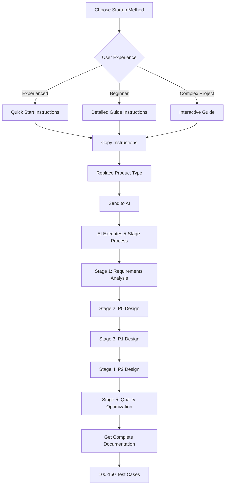

# testcase-generate-ai

English | [中文](README.md)


## 📋 Project Overview

A standardized test case design toolkit based on the successful experience of Trade module, capable of rapidly generating high-quality test cases for any product type.

### 🤖 Technical Support
- **AI Model**: Claude Sonnet 4 (Anthropic)
- **Development Platform**: Augment Agent (Augment Code)
- **Core Capability**: World-leading codebase context engine + Intelligent test case design

### 📊 Project Statistics
- ✅ **130 cases** Trade module success story
- 🎯 **8 types** Product-specific templates
- 📚 **3 modes** Startup options
- 📋 **1** Real project case
- 🛠️ **Complete** Quality assurance system

## 📁 Directory Structure

```
testcase-generate-ai/
├── README.md                           # This document
├── README_EN.md                        # English version
├── 📁 1-启动指令库/                     # Quick startup instruction set
│   ├── 快速启动指令.md                  # For experienced users
│   ├── 详细引导指令.md                  # For beginners
│   └── 交互式引导指令.md                # For complex projects
├── 📁 2-标准工作指南/                   # Core workflow documentation
│   ├── 完整工作指南.md                  # Main work guide (Recommended)
│   ├── 质量控制标准.md                  # Quality standards and checklists
│   └── 成功经验总结.md                  # Trading module experience extraction
├── 📁 3-产品类型模板/                   # Product-specific templates
│   ├── 交易系统模板.md                  # Based on Trading module
│   ├── 支付系统模板.md                  # Payment-related products
│   ├── 用户管理模板.md                  # User management systems
│   ├── 电商系统模板.md                  # E-commerce platforms
│   ├── 物流系统模板.md                  # Logistics management
│   ├── 金融系统模板.md                  # Financial systems
│   ├── 教育系统模板.md                  # Education platforms
│   └── 通用系统模板.md                  # General business systems
├── 📁 4-文档模板库/                     # Standard document structure templates
│   ├── 主文档模板.md                    # Test case design main document
│   ├── 工作状态快照模板.md              # Progress tracking template
│   ├── 项目文件清单模板.md              # Document management template
│   └── 优先级排序模板.md                # Priority decision template
├── 📁 5-使用示例/                       # Actual usage cases
│   └── 使用说明.md                      # Detailed usage instructions
├── 📁 6-工具支持/                       # Auxiliary tools and resources
│   ├── 质量检查清单.md                  # Quality control tools
│   ├── 常见问题FAQ.md                   # Problem-solving guide
│   └── 最佳实践.md                      # Experience and techniques
└── 📁 7-案例库/                         # Real project cases
    ├── README.md                       # Case library overview
    └── 交易系统案例/                   # Trading system cases
```

## 🚀 Quick Start

### 🎯 3-Step Quick Launch

#### Step 1: Choose Startup Method
Select based on your experience and project complexity:
- **Quick Start** - Experienced users, 5 minutes to begin
- **Detailed Guide** - Beginners, step-by-step guidance
- **Product Template** - Specific product types, targeted design

#### Step 2: Copy Instructions
```bash
# Example: Quick start for user management system
1. Open `1-启动指令库/快速启动指令.md`
2. Copy instructions and replace [Product Type] with "User Management System"
3. Send to AI
```

#### Step 3: Get Results
- ✅ 100-150 complete test cases
- ✅ Production-level document quality
- ✅ Standardized workflow
- ✅ Traceable design process

### 🔄 Usage Flow Diagram



### 📋 Detailed Usage Methods

#### Method 1: Complete Work Guide (Recommended)
Suitable for all users, most comprehensive guidance
```
File: 2-标准工作指南/完整工作指南.md
Operation: Copy all content → Replace product type → Send to AI
```

#### Method 2: Quick Start Instructions
Suitable for experienced users, quick start
```
File: 1-启动指令库/快速启动指令.md
Operation: Copy instructions → Replace product type → Send to AI
```

#### Method 3: Product-Specific Templates
Suitable for specific product types, highly targeted
```
Directory: 3-产品类型模板/
Options: Trading System | Payment System | User Management | E-commerce System | Logistics System | Financial System | Education System | General System
```

## 📊 Expected Results

Using this toolkit, you will get:
- 100-150 complete test cases
- Production-level document quality
- Standardized workflow
- Traceable design process

## 🎯 Quality Assurance

- ✅ Based on Trading module success experience
- ✅ Five-stage standardized process
- ✅ P0/P1/P2 priority system
- ✅ Complete quality control mechanism

## 🌟 Project Features

### ✨ Core Advantages
- **🎯 Standardized Process**: Based on 130 test cases from Trading module success
- **🚀 Quick Start**: 3 startup methods, 5 minutes to begin design
- **📊 Quality Assurance**: Complete quality control mechanism and checklists
- **🔧 Practical Oriented**: All cases based on actual functions, avoiding fiction
- **📈 Reproducible**: Ensures same high-quality standards every time

### 🎨 Design Philosophy
- **Quality over Quantity**: Precise coverage, practical orientation
- **User Value Oriented**: Evaluate test priorities from business value perspective
- **Continuous Improvement**: Continuously optimize based on practical experience

## 📊 Success Cases

### Trade Module Case
- **Project Scale**: 130 test cases, 8 core scenarios
- **Document Quality**: 1900+ lines of production-level documentation
- **Coverage Completeness**: 100% functional coverage, focused priorities
- **Executability**: 100% executable, no fictional functions

## 🤝 Contributing

We welcome all forms of contributions!

### How to Contribute
- 🐛 Report issues and bugs
- ✨ Propose new features
- 📝 Improve documentation and templates
- 🎯 Share usage experiences

See [CONTRIBUTING.md](CONTRIBUTING.md) for details

## 📄 License

This project is licensed under the [MIT License](LICENSE).

## 📞 Support

### 📚 Documentation Support
- [FAQ](6-工具支持/常见问题FAQ.md)
- [Best Practices Guide](6-工具支持/最佳实践.md)
- [Detailed Usage Instructions](5-使用示例/使用说明.md)

### 🔗 Related Links
- [Changelog](CHANGELOG.md)
- [Contributing Guide](CONTRIBUTING.md)
- [Issue Feedback](https://github.com/allenjxd/testcase-generate-ai/issues)
- [中文文档](README.md)

---

⭐ If this project helps you, please give us a Star!
